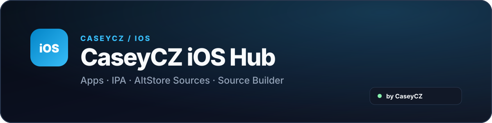

  

  
  

  Moderní rozcestník pro <strong>iOS aplikace, IPA soubory, AltStore / SideStore zdroje a vlastní Source Builder</strong>.

  

  

## O projektu

**CaseyCZ iOS Hub** je moderní katalog pro iOS sideloading, veřejné AltStore / SideStore zdroje a vlastní kombinované source JSONy.

Web nabízí přehled vybraných veřejných zdrojů, kontrolu jejich dostupnosti a **Source Builder**, který umí spojit kompatibilní AltStore Classic katalogy do jednoho vlastního CaseyCZ Mixu.

## Hlavní funkce

- 📱 připravená sekce pro budoucí CaseyCZ IPA releasy
- 🔗 katalog AltStore Classic, AltStore PAL a SideStore zdrojů
- 🟢 automatická kontrola dostupnosti a JSON struktury
- 🧩 Source Builder pro kombinování kompatibilních Classic zdrojů
- 🧹 deduplikace aplikací podle `bundleIdentifier`
- ➕ přímé otevření zdroje přes AltStore URL scheme
- 📋 kopírování původní i sloučené source URL
- 🇨🇿 / 🇬🇧 české a anglické rozhraní
- 🌙 tmavý / světlý vzhled ve stylu CaseyCZ

## Source Builder

Builder kombinuje menší veřejné Classic zdroje, které lze rozumně sloučit do jednoho JSONu. Velké komunitní katalogy a PAL zdroje se přidávají přímo a do Mixu se nezahrnují.

Automatizace v GitHub Actions pravidelně:

- stáhne povolené zdroje,
- ověří JSON a `apps`,
- spočítá dostupné aplikace,
- vytvoří kombinované soubory v `mix/`,
- aktualizuje stav webu.

## Zdroje

Katalog používá vlastní whitelist v `sources/registry.json`. Repo [awesome-altstore](https://github.com/victordedomenico/awesome-altstore) slouží pouze jako jeden z podkladů pro objevování zdrojů; jednotlivé URL jsou před zařazením kontrolované samostatně.

CaseyCZ iOS Hub cizí IPA soubory nerehostuje. Sloučený source zachovává původní download URL jednotlivých projektů.

## Podpora

  

   
  Naskenuj QR kód nebo klikni na tlačítko.

