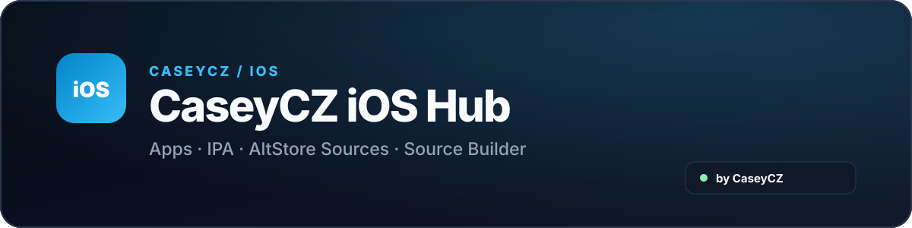

  

  
  

  Katalog pro <strong>kompatibilní iOS zdroje, Source Builder a praktické iOS nástroje</strong>.

  

## O projektu

**CaseyCZ iOS Hub** je živý katalog veřejných iOS source repozitářů. Zdroje se pravidelně kontrolují; pokud některý přestane odpovídat, jeho karta zůstane v katalogu označená jako Offline a instalační tlačítka se dočasně vypnou.

## Hlavní funkce

- kompatibilní Classic/PAL iOS zdroje s installer podporou řízenou z jednoho centrálního registru
- filtry podle typu zdroje, žánru, platformy a Mix kompatibility
- vyhledávání podle zdroje i názvu aplikace
- samostatná stránka **Custom Source Builder** pro všechny online zdroje
- interaktivní **Help Center** s výběrem metody, diagnostikou chyb, průvodcem konfigurací a odkazy na oficiální dokumentaci
- automatický stav `PASS / TRY`
- hotové kompatibilní source balíčky a přímé deep-linky pro podporované instalátory
- automatická deduplikace aplikací podle `bundleIdentifier`
- kontrola zdrojů každých 6 hodin
- EN / CZ / DE / ES / FR, výchozí jazyk EN
- uložený jazyk, vzhled, filtry a výběr Builderu
- **DEB → IPA Converter (Beta)** pro iPhone, iPad, Mac a PC

## Kompatibilní source instalátory

Hotové CaseyCZ zdroje se generují automaticky z aktuálně dostupných kompatibilních zdrojů. Stabilní buildy mají ve výchozích balíčcích přednost; Nightly zdroje zůstávají dostupné pro ruční výběr v samostatném Builderu.

Podpora instalátorů, jejich pořadí a deep-linky jsou definované centrálně v `src/js/installers.js`, takže další installer není potřeba ručně doplňovat do každé source karty.

CaseyCZ iOS Hub cizí IPA soubory nerehostuje. Výsledné source JSONy zachovávají původní veřejné download URL jednotlivých projektů.

## Soukromí a obsah třetích stran

Google Analytics se načítá až po výslovném souhlasu uživatele. Volbu lze kdykoli změnit přes **Cookie settings** a podrobnosti jsou na stránce `privacy.html`.

iOS Hub je nezávislý projekt a není přidružený k AltStore, SideStore, LiveContainer, Feather, FlareStore ani k autorům katalogizovaných Sources, pokud to výslovně neuvádí původní projekt. Registry u každého Source sleduje stav compliance kontroly; neprověřený Source není označován jako právně ověřený. Pokud je Source označen jako `restricted`, Builder ani automatický generátor ho nesmí zahrnout do Mixů nebo balíčků.

## DEB → IPA Beta

Převod probíhá lokálně v prohlížeči bez uploadu `.deb` na server. Funguje pro kompatibilní balíčky obsahující skutečnou `.app` aplikaci.

Ne každý Debian balíček lze bezpečně převést pouze přebalením. Jailbreak tweaky, knihovny, systémové balíčky a aplikace využívající speciální filesystem metadata nebo symlinky mohou vyžadovat desktopový nástroj. Výsledná IPA také není automaticky podepsaná.

## Podpora

  

   
  Naskenuj QR kód nebo klikni na tlačítko.

